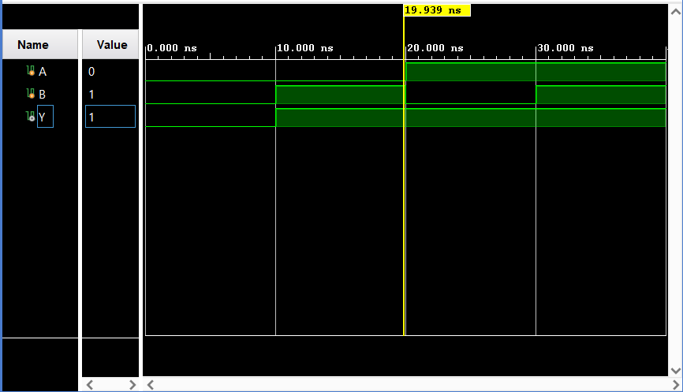
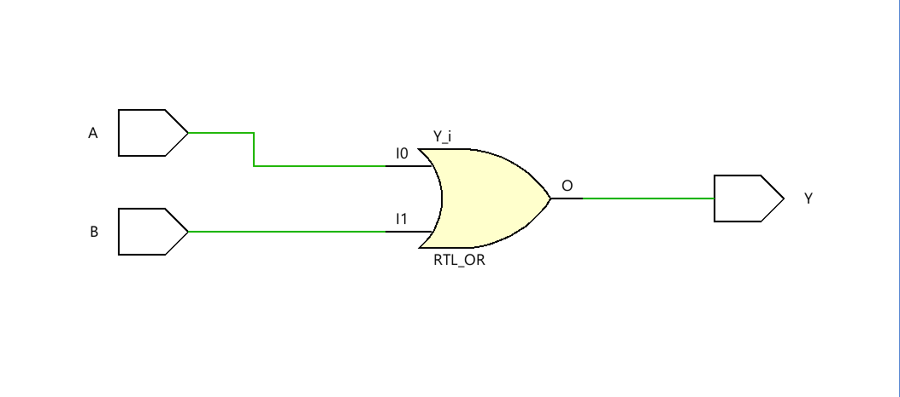

# Logic Gates (OR Gate using Verilog)

## Project Overview

This project demonstrates the implementation of a **basic OR logic gate** using **Verilog HDL**. It is intended for **learners and developers** who want hands-on experience with digital logic design and FPGA implementation.

The repository includes:

* Verilog **design file** for the OR gate 
* **Testbench** for simulation and verification
* FPGA implementation using **Xilinx Vivado** 
* Hardware testing on **Arty A7 FPGA**

## Objectives

* Learn how to write a simple OR gate in Verilog
* Simulate the design using a testbench
* Generate a bitstream file
* Implement and run the design on an FPGA board

## Tools & Technologies

* **Hardware Description Language:** Verilog
* **FPGA Board:** Arty A7
* **Design Tool:** Xilinx Vivado
* **Simulation:** Vivado Waveform Viewer
* **Constraints:** XDC file

## Project Structure

```
Logic-Gates/
│
├── design/
│   └── OR_gate.v
│
├── testbench/
│   └── OR_gate_tb.v
│
├── constraints/
│   └── OR_gate_const.xdc
│
├── images/
│   ├── Waveform.png
│   ├── Schematic.png
│   ├── Arty_A7_100t.png
│   └── Implementation.png
│
└── README.md
```

## Project Screenshots

### Waveform Simulation

This waveform verifies the correct functionality of the OR gate using the testbench.



### Design Schematic

Schematic view generated in Xilinx Vivado showing the OR gate logic.


### FPGA Board (Arty A7)

Target hardware platform used for implementation.


### Implemented Design

Final implemented design after synthesis and implementation in Vivado.


## How to Run the Project

1. Open **Xilinx Vivado**
2. Create a new project and add:

   * Verilog design file
   * Testbench file
   * Constraints file
3. Run **Behavioral Simulation** to observe waveform results
4. Synthesize and implement the design
5. Generate the **bitstream**
6. Program the **Arty A7 FPGA board**
7. Observe the AND gate functionality on the hardware

## Design Flow

* Verilog coding of OR gate 
* Schematic generation in Vivado
* Waveform simulation using testbench 
* Bitstream generation using constraints
* Hardware implementation on FPGA

## Target Audience

* Beginners learning **Verilog HDL**
* Students working with **FPGA boards**
* Developers exploring **digital logic design**

## Project Status

 AND gate implemented and tested successfully
 Future scope: NOT, NAND, NOR, XOR gates

## License

This project is for educational purposes. Feel free to use and modify it for learning.

---

If you like this project, don’t forget to star the repository!


